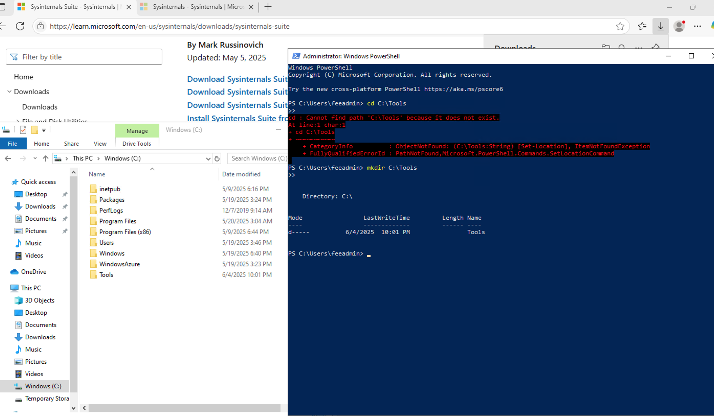
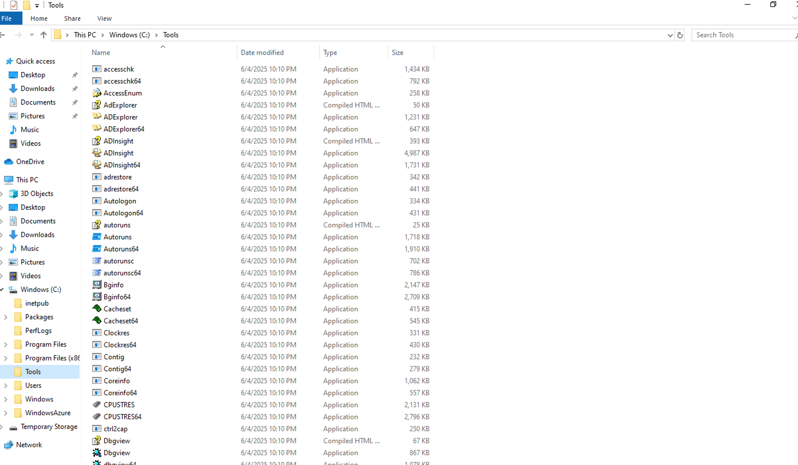

# 🔍 Scheduled Task Persistence Lab: Attacker vs. Analyst

> In this lab, I play both sides: the attacker planting a persistence mechanism, and the threat hunter detecting and remediating it — all using free tools, Sysmon, and Microsoft Sentinel.

---

## 🧧 Part One: Attacker's Perspective – Gaining Persistence

### 🛠️ 1. Environment Setup

To simulate a real-world persistence attack, I started by building a clean lab environment on a Windows VM.

- Created `C:\Tools` directory
- Extracted Sysinternals Suite
- Installed Sysmon using SwiftOnSecurity’s trusted config

```powershell
Invoke-WebRequest -Uri https://raw.githubusercontent.com/SwiftOnSecurity/sysmon-config/master/sysmonconfig-export.xml -OutFile C:\Tools\Sysmon\sysmonconfig.xml
C:\Tools\Sysmon\Sysmon64.exe -accepteula -i C:\Tools\Sysmon\sysmonconfig.xml
```

📸  
  
*Created C:\Tools manually using PowerShell.*

  
*Extracted Sysinternals Suite into the Tools directory.*

  
*Organized Sysmon files into a dedicated subfolder.*

---

### 🎯 2. Planting the Persistence

To mimic how attackers achieve persistence, I created a scheduled task that launches `calc.exe` every time a user logs in.

```powershell
schtasks /create /tn "WinUpdater" /tr "C:\Windows\System32\calc.exe" /sc onlogon /rl highest /f
```

📸  
  
*Scheduled task created using schtasks.exe — simulates persistence by launching a benign payload.*

---

### 🧾 3. Task Scheduler View

📸  
  
*Viewed the task inside Task Scheduler. It looks harmless but demonstrates how attackers blend in with normal operations.*

---

## 🔐 Part Two: Threat Hunter’s Perspective – Detect & Remediate

### 🧠 4. Detecting with Sysmon

Once Sysmon was installed, it logged process creation events, including the use of `schtasks.exe`.

📸  
  
*Sysmon Event ID 1 captured the creation of the scheduled task, including full command line context.*

---

### 🛰️ 5. Hunting in Microsoft Sentinel

Using KQL, I hunted for signs of the scheduled task across the endpoint using Microsoft Sentinel.

```kql
DeviceProcessEvents
| where FileName == "schtasks.exe"
| where ProcessCommandLine contains "WinUpdater"
| project TimeGenerated, DeviceName, InitiatingProcessAccountName, ProcessCommandLine
| order by TimeGenerated desc
```

📸  
  
*KQL query successfully detected the creation of the scheduled task across logs in Sentinel.*

---

### ⚠️ 🧠 Real-World Scenario: Why This Would Be Detected

In a real SOC, this behavior would trigger alerts from Microsoft Defender or Sentinel:

- `schtasks.exe` run with elevated privileges
- Task name mimics a system update but doesn’t match known baselines
- Timing or user context appears unusual

An analyst would investigate via Sysmon logs or Sentinel queries and identify the task as a persistence mechanism — just as demonstrated in this lab.

---

### 🧼 6. Remediation

After detection, I removed the suspicious task using PowerShell.

```powershell
schtasks /delete /tn "WinUpdater" /f
```

📸  
  
*Deleted the malicious scheduled task to complete remediation.*

---

## 🧠 Summary & Takeaways

This lab demonstrated:

- ✅ How attackers use scheduled tasks for persistence  
- ✅ How to detect that behavior using Sysmon and Sentinel  
- ✅ How to respond with PowerShell remediation  

All actions were performed on a controlled VM using free and enterprise-relevant tools like Sysinternals and Microsoft Sentinel.

---

## ✨ Skills Demonstrated

- Endpoint visibility using Sysmon  
- Threat detection with Microsoft Sentinel and KQL  
- Adversary emulation using native Windows tools  
- Hands-on incident response and remediation  
- Understanding of attacker TTPs and real-world detection logic  
